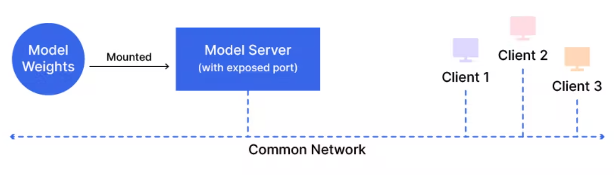

# MNIST inference on NVIDIA Triton

As shown in the diagram, the primary advantage that a model server provides is its ability to “serve” multiple client requests simultaneously. This means that if multiple applications are using the same model to run inference, then a model server is the way to go.

This extends to a second advantage, that is, since the same server is serving multiple client requests simultaneously, the model does not consume excessive CPU/GPU memory. The memory footprint roughly remains the same as that of a single model. Further, the model server can be hosted on a remote server (e.g., AWS, Azure, or GCP), or locally in the same physical system as your client(s). The inference latency would vary depending on the closeness of the server to the client(s) and the network bandwidth. Though a large number of simultaneous requests would slow down the inference speed significantly, in which case, multiple instances of the model server can be hosted, and the hosting hardware can be scaled up as a solution.

## 1. Flask (Custom) Model Server
We need a model. So, let’s train one! Feel free to use any compatible model, I am using the official Keras MNIST example, and save the model in TensorFlow SavedModel format.
#### 1.1 Run the training script to train and save the model.
```sh
$ python train.py
```

> 📄 NOTE - The Triton server expects the models and their metadata to be arranged in a specific format. The following is an example for the TensorFlow and PyTorch model, respectively:
```
tfmobilenet
├── 1
│   └── model.savedmodel
│       └── serialized files
├── config.pbtxt
└── labels.txt
torchmobilenet
├── 1
│   └── model.pt
├── config.pbtxt
└── labels.txt
```

#### So, 
After training we need to restructure the model contents to load model into `Triton Inference Server` in the next section.<br>
Move the SavedModel contents to `model_repository/<model-name>/1/model.savedmodel/<SavedModel-contents>`. The detailed instructions can be found in the official readme provided by Nvidia.
```
.
├── model_repository
│    ├── mnist_model
│    │   ├── 1
│    │   │   └── model.savedmodel
│    │   │       ├── assets
│    │   │       ├── keras_metadata.pb
│    │   │       ├── saved_model.pb
│    │   │       └── variables
│    │   │           ├── variables.data-00000-of-00001
│    │   │           └── variables.index
... ... ...
... ... ...
```


#### 1.2 Run inference script which is integrated with Flask to host it as a server which will act as the “model server”.
```sh
$ python flask/server.py
```
#### 1.3 Test the model server using curl.
```sh
$ curl -X POST -F image=@images/sample_image.png http://127.0.0.1:5000/mnist_infer

# Get Response
{"Prediction":"7"}
```

----

## 2. Triton Inference Server
#### 2.1 Install Triton Docker Image

Before you can use the Triton Docker image you must install
[Docker](https://docs.docker.com/engine/install). If you plan on using
a GPU for inference you must also install the [NVIDIA Container
Toolkit](https://github.com/NVIDIA/nvidia-docker).
Pull the image using the following command:

```sh
$ docker pull nvcr.io/nvidia/tritonserver:<xx.yy>-py3
```

Where \<xx.yy\> is the version of Triton that you want to pull. I am using `22.08` currently.

#### 2.2 Run Triton Server
Triton is optimized to provide the best inferencing performance by using GPUs, but it can also work on CPU-only systems. In both cases you can use the same Triton Docker image.


Use the following command to run Triton with the example model
repository you just created. The [NVIDIA Container
Toolkit](https://github.com/NVIDIA/nvidia-docker) must be installed
for Docker to recognize the GPU(s).

```sh
$ docker run --gpus all --rm -it -p 8000-8002:8000-8002 --name triton_mnist -v ${PWD}/model_repository:/models nvcr.io/nvidia/tritonserver:22.08-py3 tritonserver --model-repository=/models --strict-model-config=false
```
- In this command, use the `--gpus all` flag only if you have a GPU and have nvidia-docker installed. Else skip it if you want to run CPU inference (slower).
- Use the `--rm` (optional) flag if you want the container to be deleted once you stop the server.
- Use the `--it` (optional) flag to view the container logs and stop them using keyboard interrupt (Ctrl+C).
- Use the `--p` flag to map the ports from inside the container to your host system. Without this, the inference will not take place since the program on the host system will not have access to the port inside the container.
- Use `--name` (optional) to identify the container with a chosen name. Otherwise, a random one will automatically be assigned.
- Use `-v` to mount the volumes into the container. Here $PWD points to the current directory, assuming your model is located in the same directory.
- The docker image name is: `nvcr.io/nvidia/tritonserver:22.08-py3` or you can specify docker `<image-tag>`
- Use `--model-repository=/models` points to the directory containing the model name and the files inside it. (Directory structure is very important)
- `strict-model-config=false` This flag allows the Triton Server to auto-configure for the given model. Alternatively, a specific config.pbtxt can be created to specify the config. But that is again beyond the scope of this article, and more information can be found here: [Triton Model Configuration Readme.](https://github.com/triton-inference-server/server/blob/main/docs/model_configuration.md)

After you start Triton you will see output on the console showing the server starting up and loading the model. When you see output like the following, Triton is ready to accept inference requests.

```
I0903 14:02:06.004545 1 server.cc:631] 
+-------------+---------+--------+
| Model       | Version | Status |
+-------------+---------+--------+
| mnist_model | 1       | READY  |
+-------------+---------+--------+
...
...
...
I0903 14:02:06.035974 1 grpc_server.cc:4610] Started GRPCInferenceService at 0.0.0.0:8001
I0903 14:02:06.038149 1 http_server.cc:3316] Started HTTPService at 0.0.0.0:8000
I0903 14:02:06.081332 1 http_server.cc:178] Started Metrics Service at 0.0.0.0:8002
```
> 📄 NOTE - If a model fails to load the status will report the failure and a reason for the failure. If your model is not displayed in the table check the path to the model repository and your CUDA drivers.


#### 2.3 Verify Triton Is Running Correctly
If you have followed all instructions properly, then you should find the JSON model config by visiting http://localhost:8000/v2/models/mnist_model/config on your browser. 

The general format for this URL is: `http://<host-ip-address>:<mapped-http-port>/v2/models/<model-name>/config`

#### 2.4 Finally, Run Inference
In my script, I included the both client example:
- HTTP client
- gRPC client

Now run inference script to test our MNIST model (or you can customize the code as per your need):
```sh
$ python triton-infer.py

# Response
HTTP Service | Prediction: 7
gRPC Service | Prediction: 7
```
----

### Reference
- https://github.com/triton-inference-server/server/blob/main/docs/quickstart.md
- https://hackernoon.com/deploying-deep-learning-models-with-model-server
- https://www.megatrend.com/en/machine-learning-deployment-services%EF%BF%BC/


That's all about Triton, if you love my work don't forget to 🌟 star. Thanks
